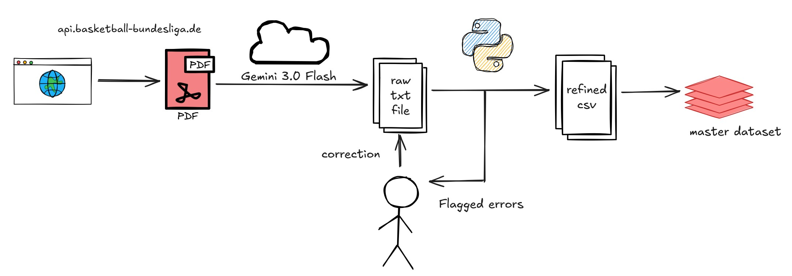

# 🏀 German BBL Play-by-play Data Pipeline

## 📄 Overview
A robust data engineering pipeline designed to digitize, clean, and analyze historical Play-by-Play data from the German Basketball Bundesliga (BBL).

This repository contains the source code for transforming unstructured PDF game reports into structured, queryable CSV datasets using **LLMs (Gemini 3.0 Flash)**, as well as my master dataframe containing all events from the first 100 games of the 25/26 season ready for analysis. Included in the dataframe are columns denoting all players who are on the court during each event, enabling you to calculate on-off stats and more.

**🔗 Read the full technical breakdown on my Substack: _____**

## 🏗 Architecture

*Figure 1: The "Human-in-the-Loop" extraction workflow.*

## 🧠 LLM-assisted PDF readout
We use the pdfs that are generated by the Basketball Bundesliga themselves and provided using their API at api.basketball-bundesliga.de/reports/{teamid}/{gameid}/playbyplay, alternatively you can download them on the page of the game itself at https://easycredit-bbl.de/spiele/{gameid}#play-by-play. These pdfs sadly are not recognized as text and it is very difficult to actually extract the information.
For this purpose I used Gemini 3.0 Flash as it turned out its ability to read in these pdfs is quite good. Using this prompt:

"Read this pdf and return it as a txt. The columns in the pdf and in the txt are:
quarter, time, home action, score, diff, away action. 
Include the quarter starters row with all 5 players for both teams at the beginning of each quarter, the upper row in the home action cell and the lower row in the away action cell. Include the flag "Starters: " in front of both entries and separate the starters using commas.
Return a txt file using pipe delimiters to use in pandas, without citations. Keep in mind that every player has a jersey number in front of him e.g. 99 SMITH J. Include all events, including substitutions."

To show this exemplarily I added the pdfs of the first two games of the 25/26 season 2003986 and 2003987, as well as the output txts of the LLM in the data folder. When attempting this yourself you should initialize new sessions for each pdf to avoid hallucinations and data leakages which can be quite debilitating here.

## ⚙️ Clean-up and Transformation
Of course the output txts are not flawless and the purpose of the PDFconversion program is to clean up the easily catchable translation mistakes as well as preparing the data to being able to be used in data evaluation. The most easily catchable mistakes are related to mistakes in the quarter and time columns. 
For this, safety features filling in missing quarter values are included, otherwise the entire dataframe will be shifted and out of sync. Later on, the column 'Duration_Seconds' is created calculating the time between events. A simple query can find rows with abnormally high durations, which are always caused by wrong times entered by the LLM, this happens only once or twice every 10 games.
At the beginning of the program you will find the clean_player_name function. This is sadly the largest source of mistakes as sometimes the LLM messes up player names, e.g. 34 BEAN I instead of 34 BEAN J. This leads to issues downstream when looking at players who are actually on the court. The only way to catch this is after creating the dataframes to check for playernames of home and away teams. Messed up player names can be entered in the dictionary here to be fixed on the next run. 
Common mistakes here are O and 0 getting mixed up, no spaces between last name and first name initial and missing player numbers. These are fixed easily. 
Occasionally there are even errors in the BBL data itself, most commonly wrong numbers are entered for players. Here, sadly there is no other way of catching it other than checking all players for the teams and scanning for irregularities.

## ⚠️ Remaining issues
One source of error still remaining is occasionally, when there only is an event of the away team, it gets falsely assigned to the home team(supposed to be quarter|time||||Away event, but transcribed as quarter|time|away event|||). 
This occurs rarely, so when running investigations over a whole season, I chose to disregard this. However, sometimes, it lands on a substitution, leading to players playing for a wrong team. This usually is the case for 2 in-game minutes which is why I did not manually check and remove all instances. Just thought you should be warned.

